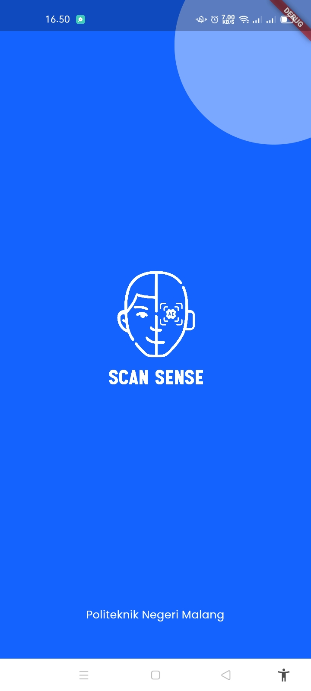
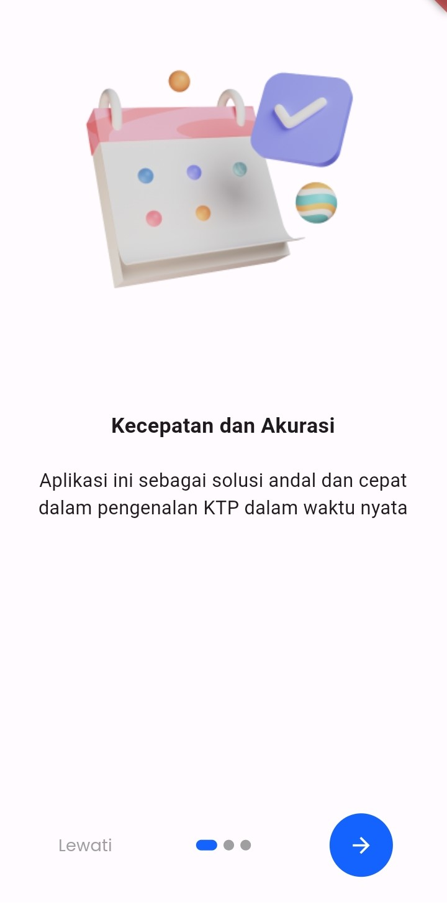
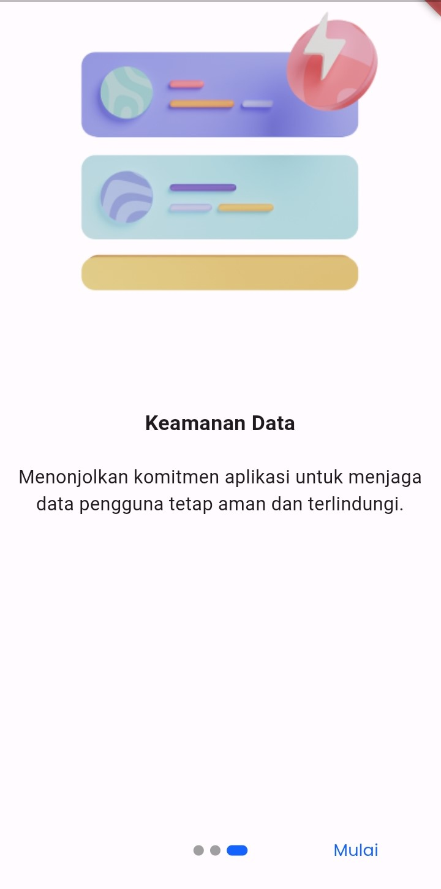
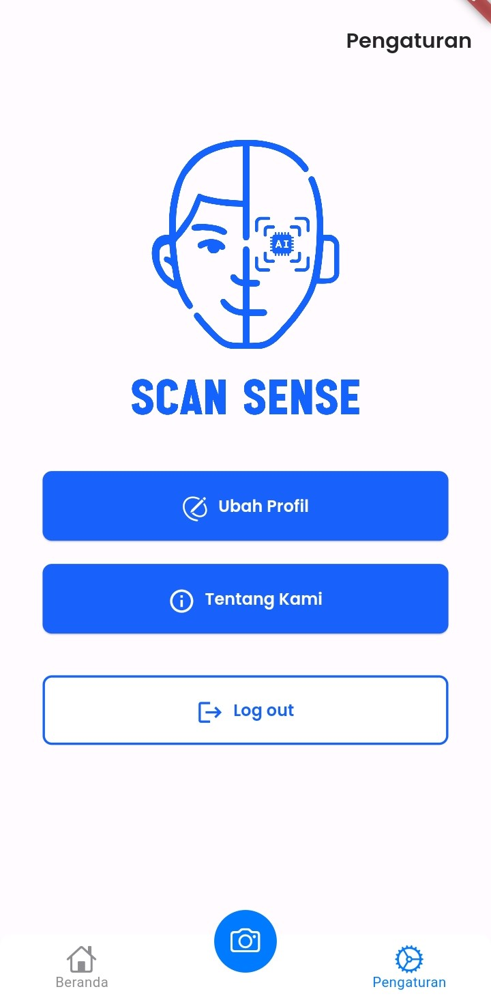
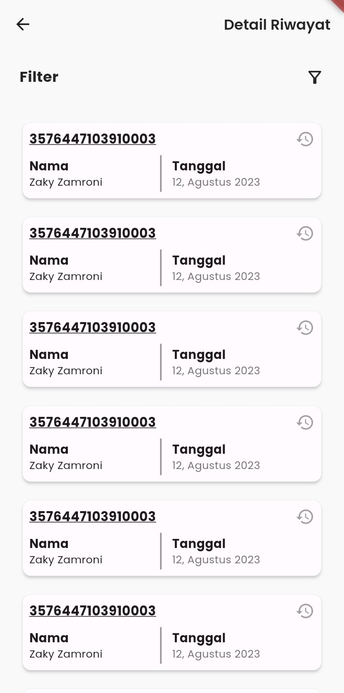
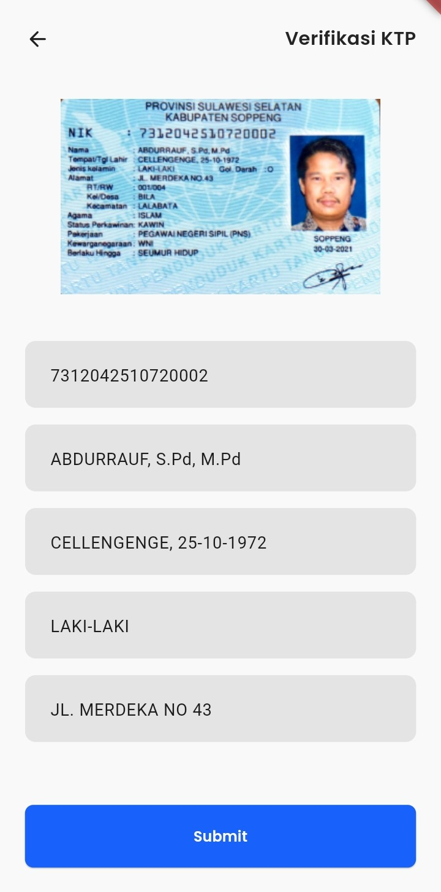
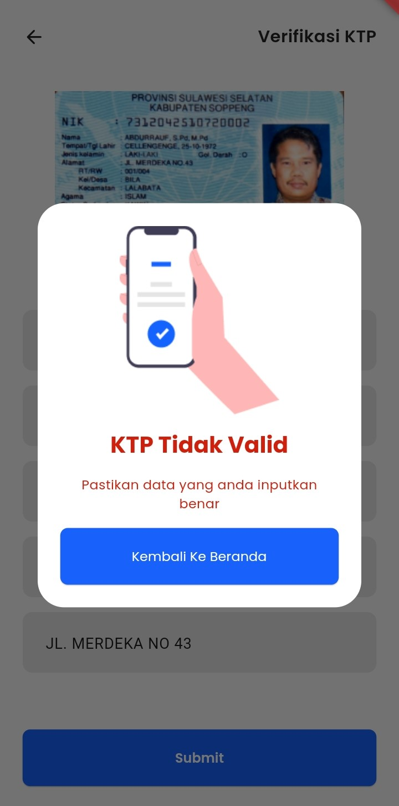

# About ScanSense

| Absen | Nama Anggota           | NIM     |
| ----- | ---------------------- | ---------- |
| 03    | Adinda Wahyu L.        | 2141720096 |
| 04    | Alfan Olivan           | 2141720078 |
| 15    | Lukas Valentino        | 2141720032 |
| 17    | M. Driya Ananta        | 2141720224 |
| 28    | Wiradarma Nurmagika B. | 2141720184 |

TAMPILAN DARI APLIKASI SCANSENSE:

# Screen dan PIC

| No. | Nama Screen       | Fitur | PIC                    |
| --- | ----------------- | ----- | ---------------------- |
| 1   | Splash Screen     | -     | Lukas Valentino        |
| 2   | On Boarding       | -     | Lukas Valentino        |
| 3   | Setting           | -     | Lukas Valentino        |
| 4   | Login             | -     | Alfan Olivan           |
| 5   | Register          | -     | Alfan Olivan           |
| 6   | Profil            | -     | Adinda Wahyu L.        |
| 7   | About Us          | -     | Adinda Wahyu L.        |
| 8   | Homepage          | -     | M. Driya Ananta        |
| 9   | History           | -     | M. Driya Ananta        |
| 10  | Detail History    | -     | M. Driya Ananta        |
| 11  | OCR Result        | -     | Wiradarma Nurmagika B. |
| 12  | OCR Screen        | -     | Wiradarma Nurmagika B. |
| 13  | Verication Result | -     | Wiradarma Nurmagika B. |

# Link Figma

LINK FIGMA : [KLIK LINK INI](https://www.figma.com/file/vDwGt144Wfs8eLNlxh7b7J/Mockup-OCR-KTP-2?type=design&node-id=0%3A1&mode=design&t=lAtKWJ9brqe514tR-1)

SCREENSHOT SCREEN :

1. Splash Screen

2. On Boarding 1

3. On Boarding 2

4. On Boarding 3

5. Login Screen

6. Register Screen

7. Homepage

8. Setting Screen

9. Profile Screen

10. About Us Screen

11. History

12. Detail History

13. OCR Screen

14. Verification Result

15. OCR Result

# Fitur Unggulan

Fitur unggulan di aplikasi ScanSense adalah aplikasi verifikasi identitas pengguna dengan menggunakan KTP dan adanya kemampuan OCR (Optical Character Recognition) serta integrasi dengan database Polinema. Adapun fitur unggalan seperti berikut:

1. Antarmuka pengguna yang mudah digunakan dan pengguna dapat mengunggah gambar KTP mereka.
2. Modul OCR yang bertanggung jawab untuk menjalankan proses OCR pada gambar KTP yang diunggah. Hal ini akan mengidentifikasi dan mengekstrak teks dari gambar tersebut.
3. Formulir pengisian data, dimana data yang telah diekstrak dari KTP akan ditampilkan dalam sebuah formulir yang bisa diedit oleh pengguna. Pengguna dapat memeriksa dan (jika perlu) memperbarui data-data tersebut.
4. Integrasi database yang terhubung dengan database sistem lain yang berisi data pengguna yang telah terverifikasi sebelumnya. Integrasi ini memungkinkan untuk memeriksa dan membandingkan data yang diunggah oleh pengguna dengan data yang ada di database.
5. Proses verifikasi yang akan membandingkan data dengan data yang ada di database. Jika data sesuai, maka verifikasi identitas dianggap berhasil.
6. Pengiriman hasil verifikasi yang akan diberikan kepada pengguna dalam bentuk pesan ataupun notifikasi yang menegaskan apakah verifikasi berhasil atau gagal.
7. Keamanan aplikasi ini memiliki lapisan yang kuat untuk melindungi data yang sensitif, seperti penggunaan enkripsi data dan akses yang terkendali ke basis data.

# Credits

Icon: 
https://www.flaticon.com/

Font:  
https://fonts.google.com/specimen/Poppins
